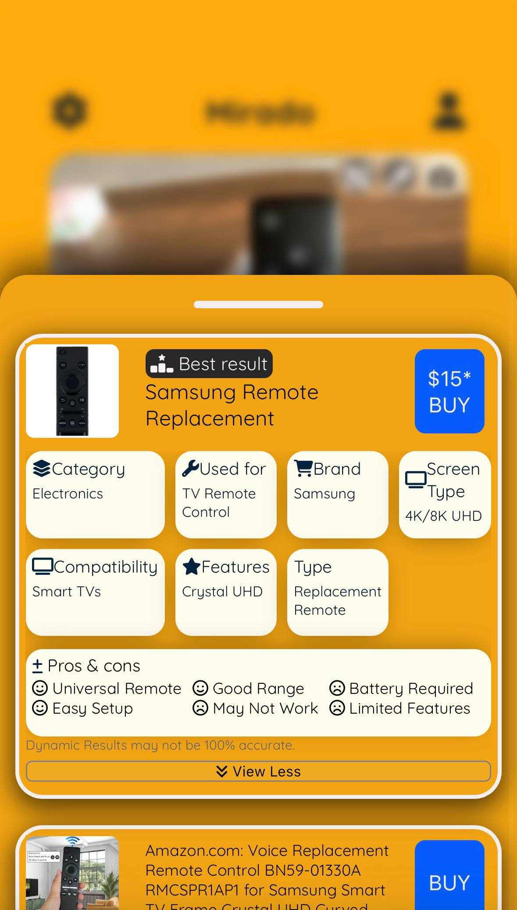
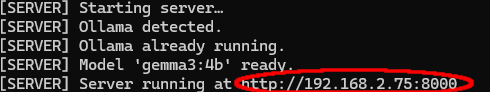
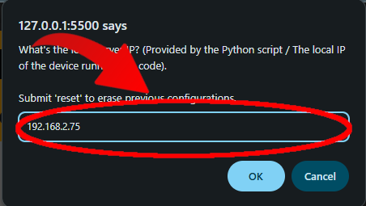

# 🛍️ Mirado 0.3.3 - OSS 
Mirado lets users photograph any product to instantly get an AI-powered summary and discover where to buy it.

<br>


## Features


- **Sorting algorithms** — Using frontend algorithms, the app finds the best results to display
- **Preference analysis (WIP)** — The app has a dedicated ```preferenceEngine.js``` file which houses all the functions to learn what the user prefers and what they like to see
- **Object tracking** — Mirado features an object tracking system to help the app and the user know what they're looking for. It can be found in the ```objectTracking.js``` file
- **Camera color correction** — Mirado also has a built in camera color correction algorithm which helps eliminate glare and perfect saturation and gamma so the object present in the camera can be thoroughly detailed. It can also be found in the ```objectTracking.js``` file.
- **Image Recognition** — Take a picture of any product and Mirado identifies it
- **AI Summaries** — Get a concise, intelligent breakdown of the product
- **Purchase Links** — Find out where to buy it, powered by SerpAPI
- **Useful Libraries** — Mirado has a lot of libraries that are made from scratch, such as ```quoteBubble.js```, ```themes.js```, or ```inAppNotifications.js```

## Prerequisites

- Python 3.x
- Ollama
- A [SerpAPI](https://serpapi.com/) account and API key

## Setup & Installation

### 1. Clone the repository

```bash
git clone https://github.com/sadramohtadi/mirado.git
cd mirado
```

### 2. Configure your API key

Open `scripts/config.js` and replace the placeholder with your SerpAPI key:

```javascript
const SERP_API = '<YOUR_SERP_API_KEY>';
```

### 3. Start the AI servers
Navigate to the `scripts/` folder and run either or both depending on which features you need:

**Product summarization:**
```bash
py HTTPAISummarry.py
```

**Image analysis:**
```bash
py HTTPimageAnalyzer.py
```
> There's a HTTP and HTTPS version of these codes. You can run either one depending on your browser.<br>
> Both servers can run simultaneously for the full experience.

### 4. Open the app

Use a Live Server in VSCode or simply open the HTML file to run the app.

### 5. Change the AI Server parameter

On the bottom of the app, tap on NOT CONFIGURED and put in the IP address provided by the Python code after running it.

<br>
<br>
<br>
<br>

## Roadmap
- Improving result accuracy
- Improving result speed
- Fixing issues
- Making the app more user friendly
- Custom upload & Search History

## Known Limitations
- Currently performs significantly better in North America

## Tech Stack

| Layer | Technologies |
|-------|-------------|
| Frontend | HTML, CSS, JavaScript |
| Backend | PHP, Python |

## License
This project is licensed under the Apache License 2.0.

## Author

Made by [@SadraMohtadi](https://github.com/sadramohtadi)

[](https://www.instagram.com/sadramohtadi)
[](https://twitter.com/@sadramohtadi)
